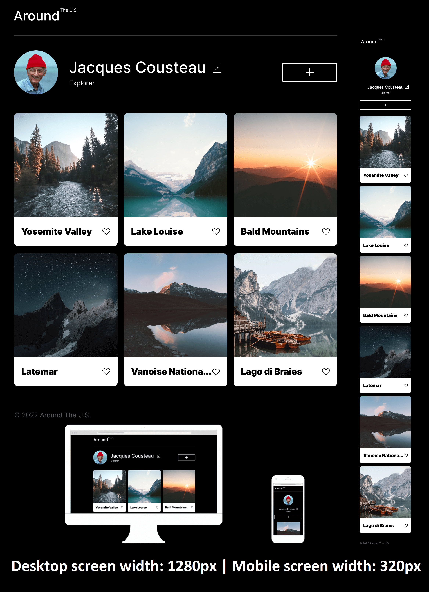

Project Name: Around The U.S. (Practicum's project 3)

Description:

The main task here is to create a website that displays correctly on popular screen sizes by using media quaries. It also involves the ue of both Flebox and Grid, as well as font styling.

Technologies and techniques used:

- CSS
- HTML5
- Positioning
- BEM naming
  -Figma

=  
**Figma**

- [Link to the project on Figma](https://www.figma.com/file/ii4xxsJ0ghevUOcssTlHZv/Sprint-3%3A-Around-the-US?node-id=0%3A1)

**Images**

The link to GitHub Pages:
https://kdmv17.github.io/se_project_aroundtheus/
